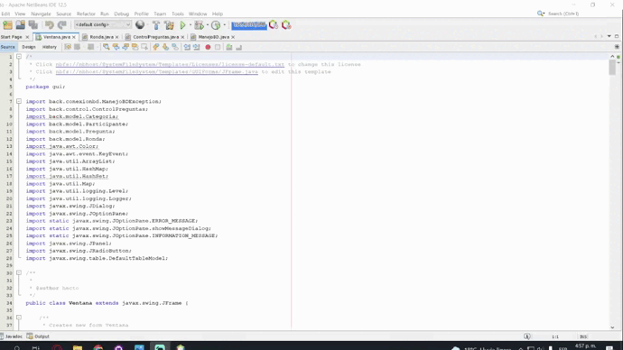
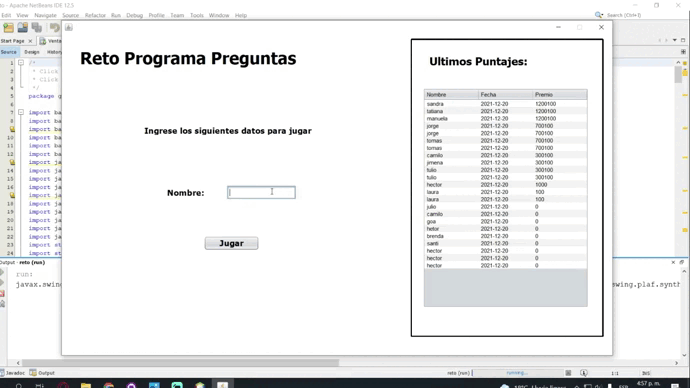
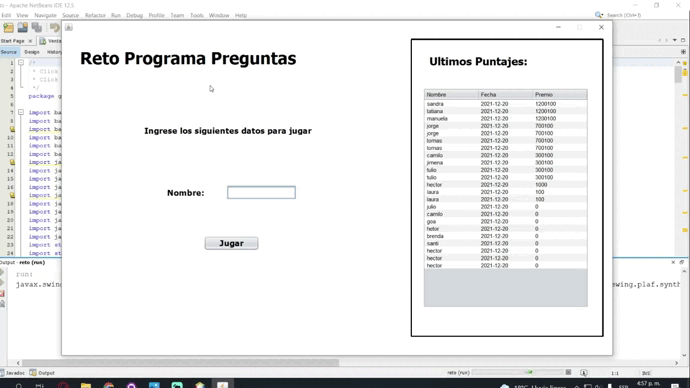
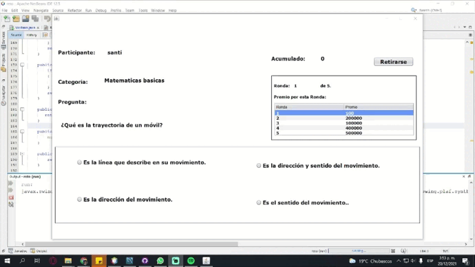
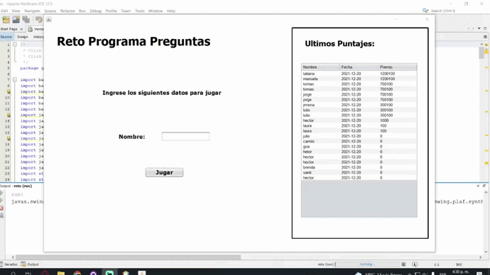

# reto_Sofka

## instrucciones de uso 

para guarda el participante siempre se guarda con la fecha del sistema

- se demora al iniciar debido al base dedatos que esta en la nube y el proveedor no es muy bueno
  ya que es para pruebas en la casle ManejoBD esta la informacion de la base de datos por si quieren 
  mirar si esta realmente almacenando los datos 
  
 

- para crear una nueva catergoria  al iniciar el programa darle ESC esto le sacara dos opciones
  entre ellas la categoria y sacara un formulario para crearla, el premio se asigna 
  automaticamente  despues de seleccionar la dificulta de la categoria
  
 
  
- para crear una pregunta al iniciar el programa darle ESC esto le sacara dos opciones
  entre ellas la pregunta y sacara un formulario para crearla, en este estara 
  los espacios para la pregunta y 4 respuestas, una lista para seleccionar cual es la respuesta correcta
  y otra para la categoria
 
 
  
- el nombre de usuario tiene maximo 7 caracteres sin ningun caracter especial solo letras minusculas o mayusculas y numeros.

 

- para responder la pregunta tienen que dar click a la respuesta y automaticamente la verifica y les carga la siguente ronda
  o les sale que perdio y guarda el acumulado y lo redirije al inicio.
  
 en caso de perder 
 

  
  
 en caso de ganar
   
- al ganar autamaticamente sale un letrero avisandole y guardando su acumulado 

  

    
    
- el retirarse se puede hacer antes de que se pierda  y responder cada pregunta en su respectiva ronda 
  podra guardar su acumulado hasta ese momento
  

  
  
